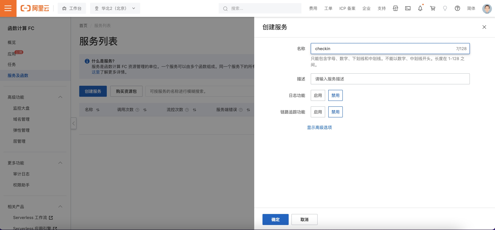
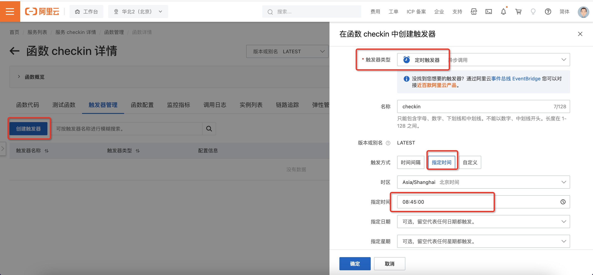

# 阿里云函数计算教程

### 一、创建服务和函数

> 地域选哪里都可以




### 二、修改超时时间并配置定时触发器

在“触发器管理”页签中添加定时触发器



在“函数配置”页签中修改超时时间


### 三、修改代码并安装依赖


```python
# -*- coding: utf-8 -*-
from dailycheckin.main import checkin


def handler(event, context):
  checkin()
```


```bash
pip3 install dailycheckin --upgrade -t .
```

### 四、添加配置文件

> ⚠️ 请务必到 [http://www.json.cn](http://www.json.cn) 网站检查 `config.json` 文件格式是否正确！


### 四、部署并测试


