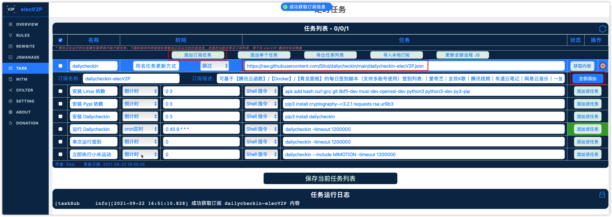
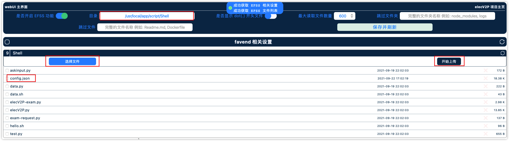

# elecV2P 使用教程

## 一、添加订阅

订阅地址: [https://raw.githubusercontent.com/Sitoi/dailycheckin/main/dailycheckin-elecV2P.json](https://raw.githubusercontent.com/Sitoi/dailycheckin/main/dailycheckin-elecV2P.json)



## 二、安装依赖等


安装顺序如下:

1. 安装 Linux 依赖
2. 安装 Pypi 依赖
3. 安装 Dailycheckin

## 三、编辑并上传配置文件

> ⚠️ 请务必到 [http://www.json.cn](http://www.json.cn) 网站检查 `config.json` 文件格式是否正确！

参考[配置说明文档](https://sitoi.gitee.io/dailycheckin/settings/) ，并修改 `config.json`

1. 单独运行一次，下方日志会提示在哪个目录中添加「config.json」文件
   

2. 点击「OVERVIEW」->「EFSS 文件管理界面」->「目录」->「选择文件」->「开始上传」
   

## 四、配置定时任务即可

> Shell 命令最后必须加上「-timeout 1200000」设置 20 分钟超时

1. 运行全部脚本

    ```bash
    dailycheckin -timeout 1200000
    ```

2. 运行指定脚本（包含），可以同时选择多个，用「空格」分开

    ```bash
    dailycheckin --include MUSIC163 BAIDU -timeout 1200000
    ```

3. 运行指定脚本（排除），可以同时选择多个，用「空格」分开

    ```bash
    dailycheckin --exclude MUSIC163 BAIDU -timeout 1200000
    ```
