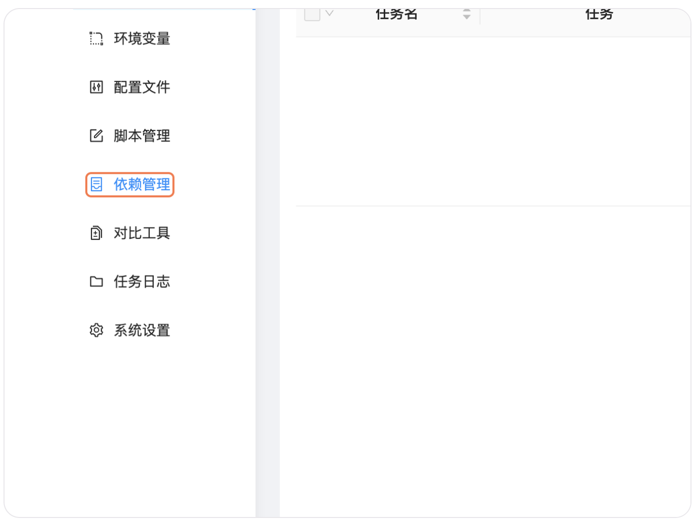
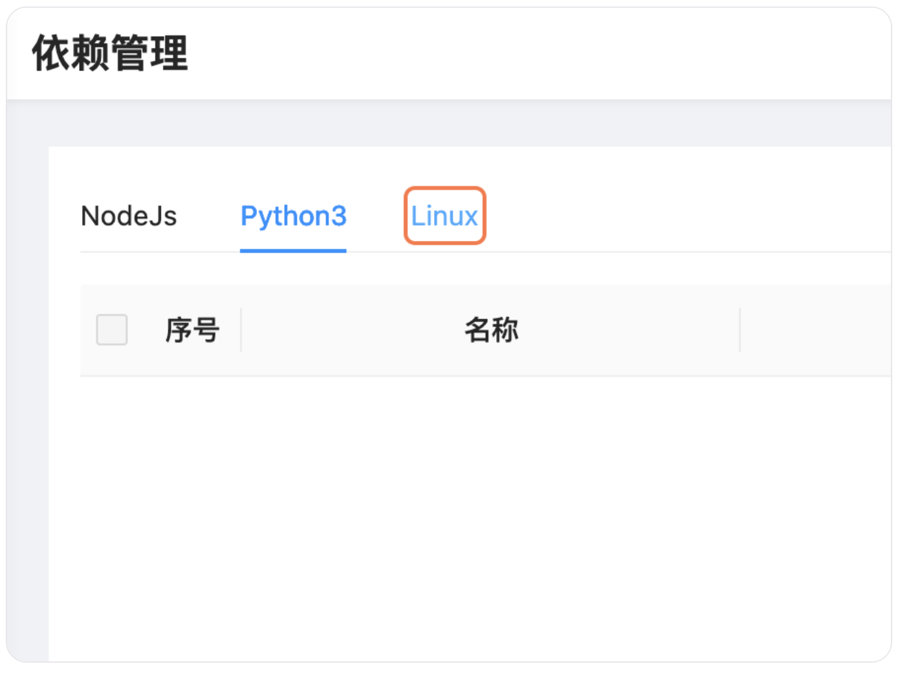
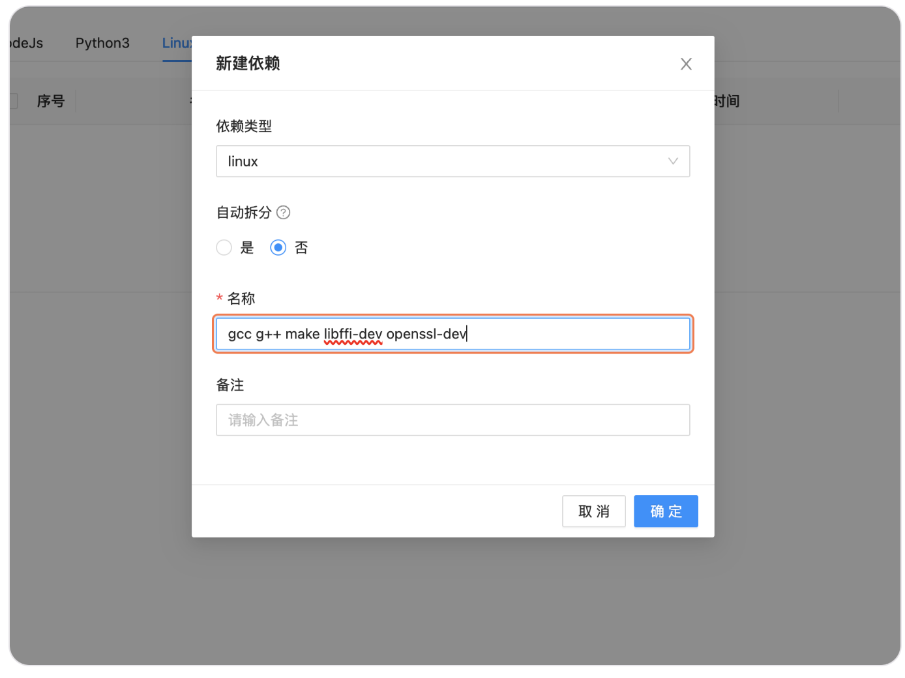
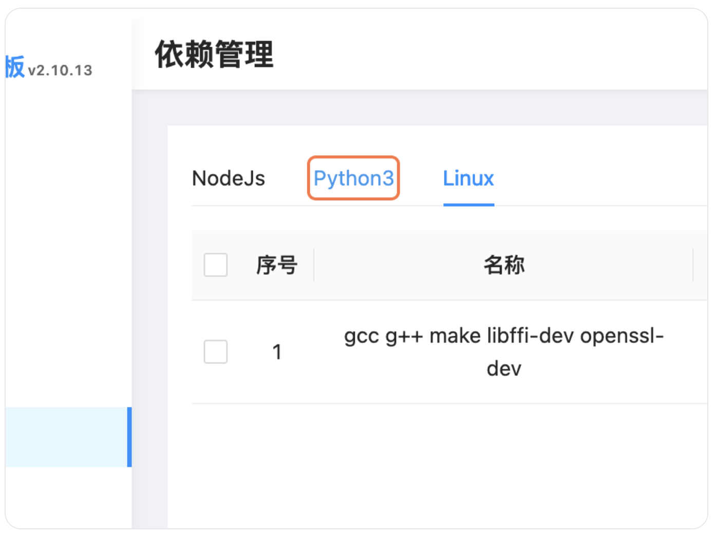
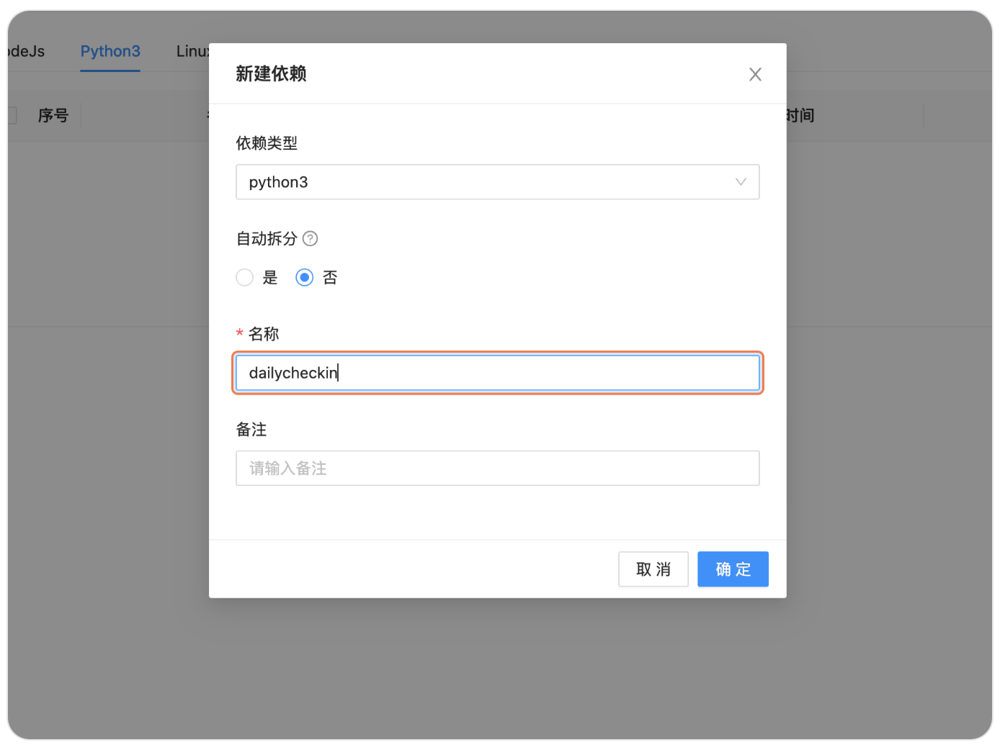
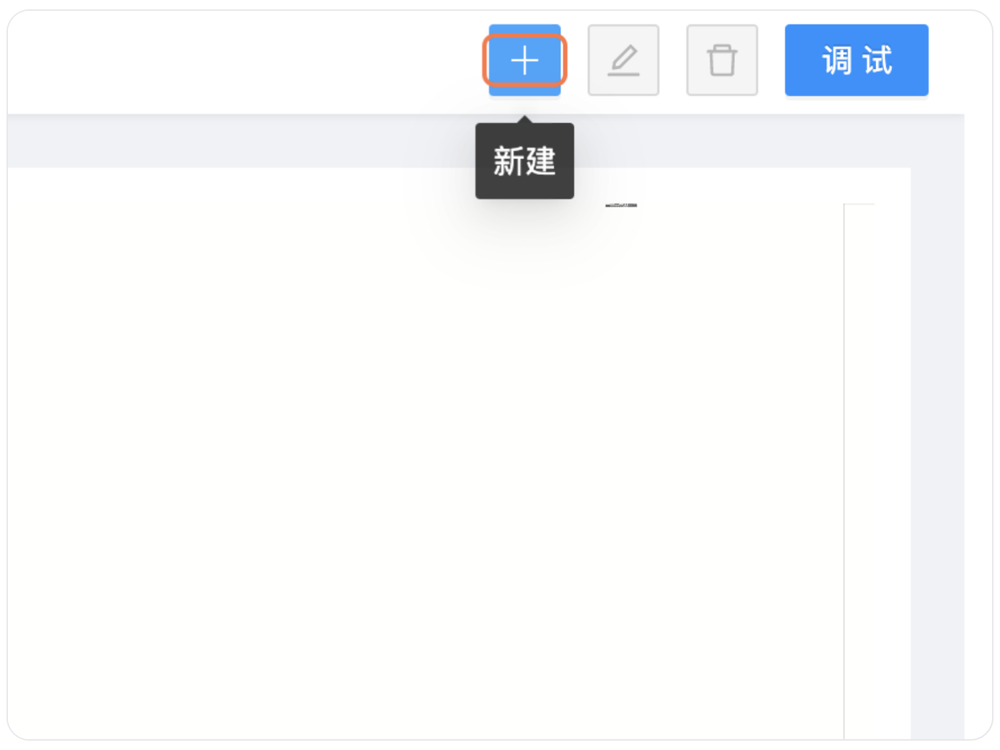
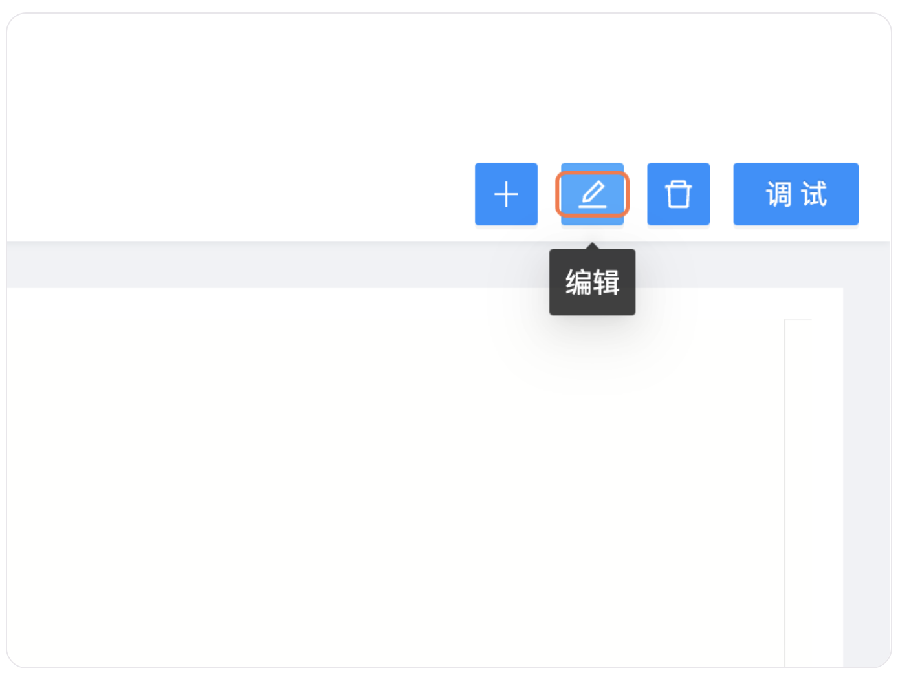
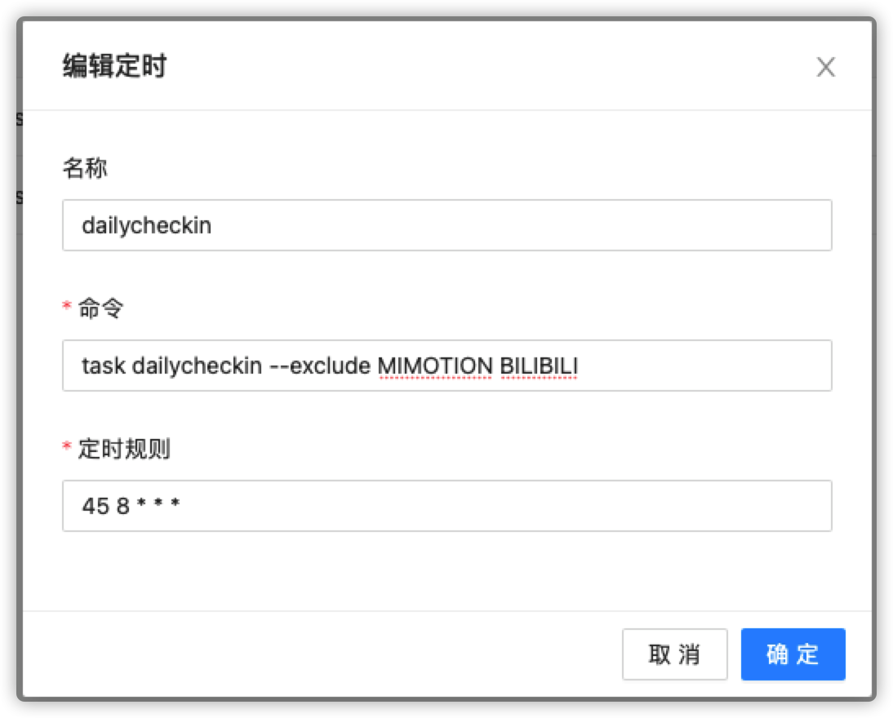

import { Cards, Card } from 'nextra/components'
import { Callout } from 'nextra/components'
import { Steps } from 'nextra/components'

<Cards>
  <Card
    title="手动部署"
    href="/install/local"
  />
  <Card
    title="Docker 部署"
    href="/install/docker"
  />
  <Card
    title="群晖部署"
    href="/install/synology"
  />
</Cards>
# 青龙使用教程

## 一、安装

<Steps>
### 选择「依赖管理」



### 新建 Linux 依赖

#### 1. 点击 Linux



#### 2. 点击新建依赖


#### 3. 输入依赖

```text copy
gcc g++ make libffi-dev openssl-dev
```



#### 4. 点击确认，等待安装完成


### 新建 Python 依赖

#### 1. 点击 Python



#### 2. 点击新建依赖


#### 3. 输入 dailycheckin



#### 4. 点击确认，等待安装完成


</Steps>

## 二、配置

<Callout
  type="warning"
  emoji="⚠️"
>
  请务必到 [https://www.json.cn/](https://www.json.cn/) 网站检查 `config.json`
  文件格式是否正确！
</Callout>

<Steps>
### 选择「脚本管理」


### 点击 ➕ 添加



### 输入文件名 config.json 后确定


### 配置 config.json 文件

参考[配置说明文档](/settings/config) ，并修改 `config.json`




</Steps>

## 三、运行

1. 运行全部脚本
   
2. 运行指定脚本（包含），可以同时选择多个，用「空格」分开
   
3. 运行指定脚本（排除），可以同时选择多个，用「空格」分开
   

## 四、更新

添加一个定时任务，名称为 更新Dailycheckin（可自定义），命令为 `task pip3 install dailycheckin --upgrade`，定时规则为 0 0 * * *。

国内机器如无法完成更新，可为命令设置镜像，将命令改为 `task pip3 install dailycheckin --upgrade -i https://pypi.mirrors.ustc.edu.cn/simple/` 后再更新。


