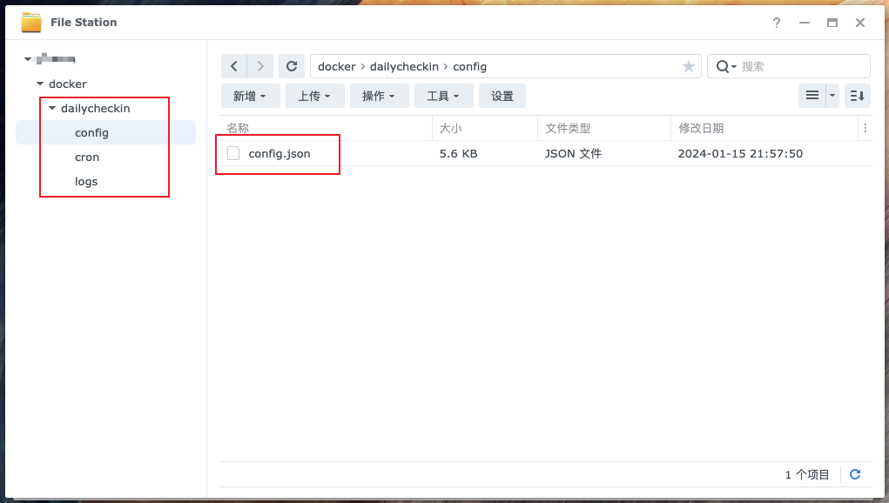
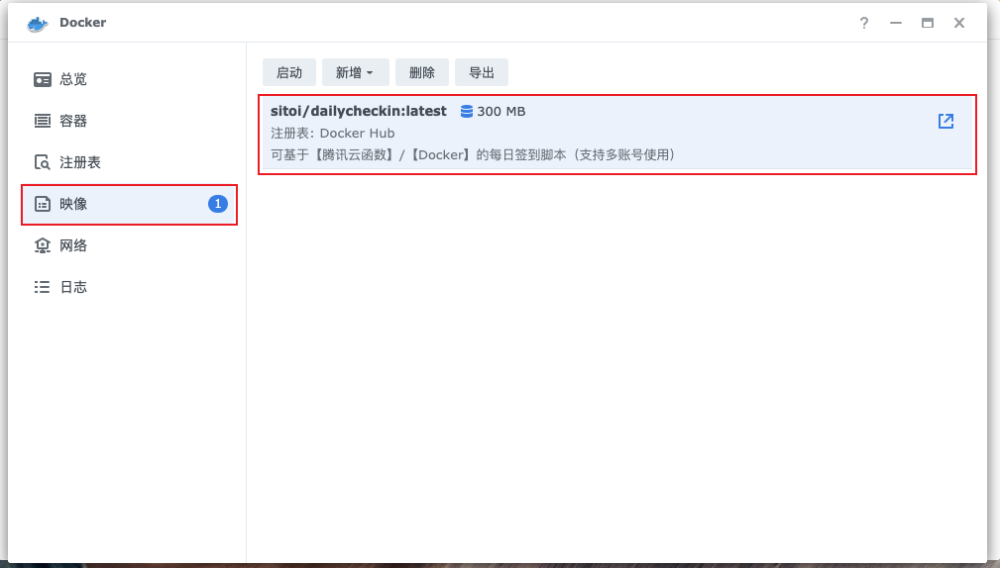
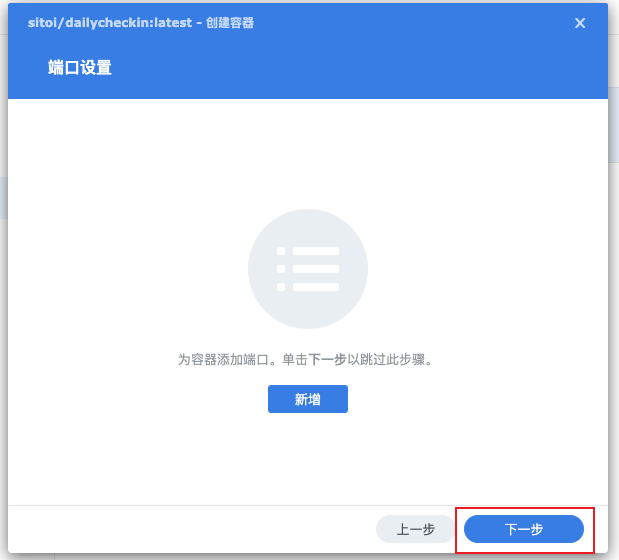
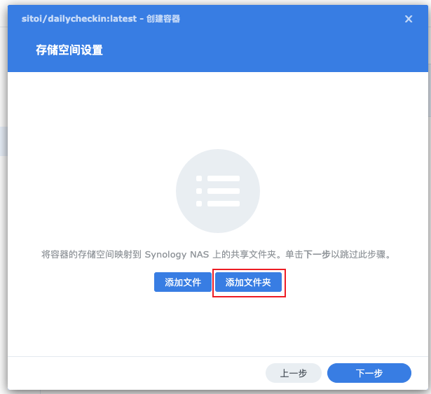
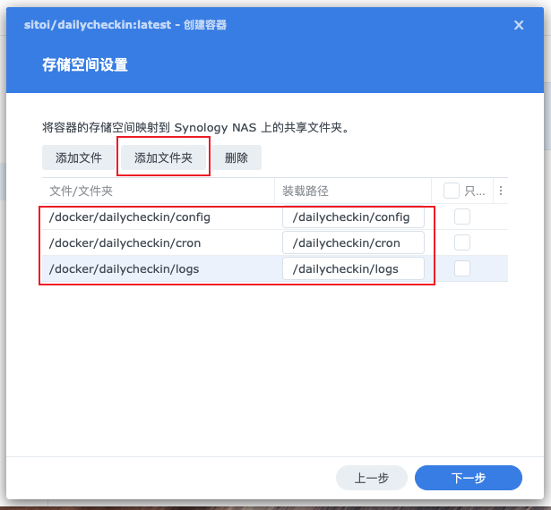
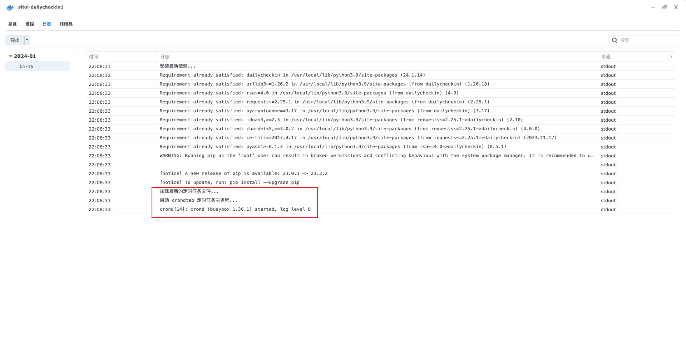

import { Cards, Card } from 'nextra/components'
import { Callout } from 'nextra/components'
import { Steps } from 'nextra/components'
import { FileTree } from 'nextra/components'

<Cards>
  <Card
    title="手动部署"
    href="/install/local"
  />
  <Card
    title="Docker 部署"
    href="/install/docker"
  />
  <Card
    title="青龙部署"
    href="/install/qinglong"
  />
</Cards>
# 群晖 Docker 使用教程

## 一、安装

<Steps>

### 新建项目目录

<FileTree>
  <FileTree.Folder
    name="dailycheckin"
    defaultOpen
  >
    <FileTree.Folder
      name="config"
      defaultOpen
    >
      <FileTree.File name="config.json" />
    </FileTree.Folder>
    <FileTree.Folder
      name="cron"
      defaultOpen
    >
      <FileTree.File name="crontab_list.sh" />
    </FileTree.Folder>
    <FileTree.Folder
      name="logs"
      defaultOpen
    ></FileTree.Folder>
  </FileTree.Folder>
</FileTree>

- `./config/config.json`: 配置文件
- `./cron/crontab_list.sh`: 配置定时任务的文件
- `./logs`: 日志文件

#### Config 目录



参考[配置说明文档](/settings/config) ，并修改 `config.json`

#### Cron 目录


修改 `./cron/crontab_list.sh` 文件, 根据实际情况修改下面的默认文件。

```bash filename="crontab_list.sh" copy
##############默认任务##############
# 每 12 小时更新 Pipy 包，如果不需要更新 pypi 包请注释掉下面这行
0 */12 * * * echo "定时任务更新依赖..." && pip install dailycheckin --upgrade --user >> /dailycheckin/logs/update-pypi.log 2>&1
# 每天的 23:50 分清理一次日志
50 23 */2 * * rm -rf /dailycheckin/logs/*.log

##############每日签到一次任务##############
# 每日签到(9:00 执行全部签到)
0 9 * * * cd /dailycheckin && dailycheckin >> /dailycheckin/logs/dailycheckin.log 2>&1
```

### 注册表搜索「dailycheckin」，双击下载


### 下载完成后，点击映像，选中「dailycheckin」，点击「启动」



### 配置网络

跳过，点击下一步


### 常规设置

☑️ 启动自动重新启动


### 端口设置

跳过，点击下一步



### 存储空间设置



##### 按照图中的文件夹添加一致的目录结构




### 容器启动成功




</Steps>

## 二、配置

<Callout
  type="warning"
  emoji="⚠️"
>
  请务必到 [https://www.json.cn/](https://www.json.cn/) 网站检查 `config.json`
  文件格式是否正确！
</Callout>

上传配置文件「config.json」到 「dailycheckin/config」目录下，参考[配置说明文档](/settings/config) ，并修改 `config.json`


## 三、运行

<Steps>

### 点击「详情」，「终端机」，点击「新增」右侧「下拉按钮」，输入「dailycheckin」命令


### 点击命令，输出如下内容，表示配置成功


</Steps>

## 更新

自动更新
