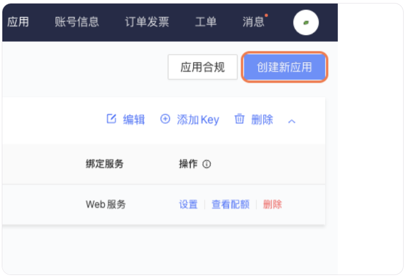
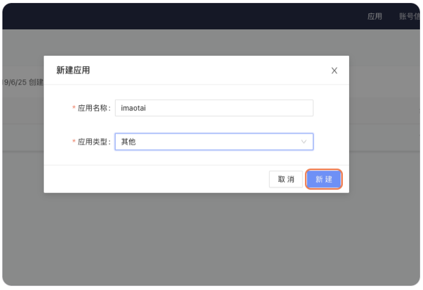
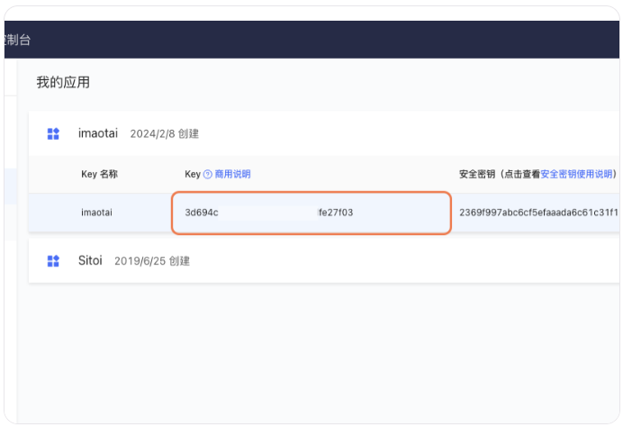
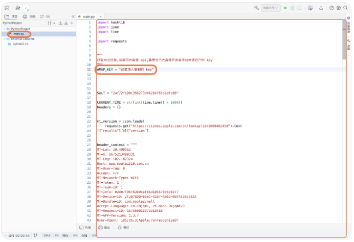
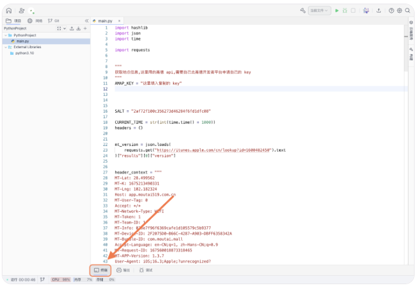
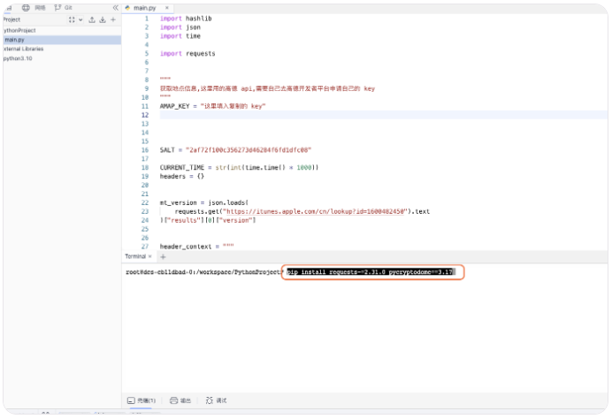
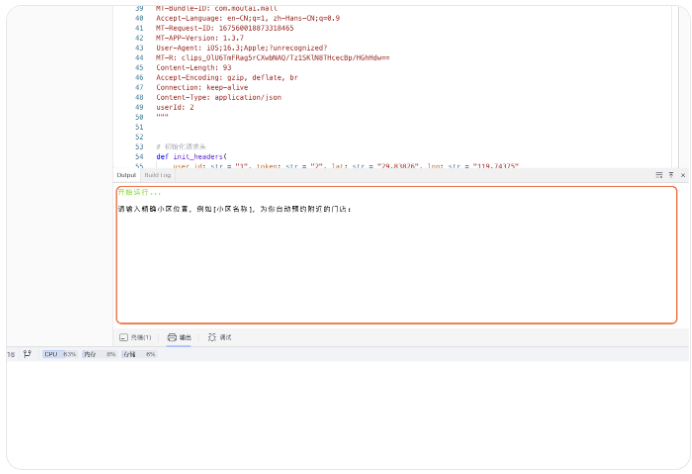

import { Callout } from 'nextra/components'
import { Cards, Card } from 'nextra/components'
import { Steps } from 'nextra/components'

<Cards>
  <Card
    title="AcFun"
    href="/settings/acfun"
  />
  <Card
    title="阿里云盘"
    href="/settings/aliyun"
  />
  <Card
    title="奥拉星"
    href="/settings/aolaxing"
  />
  <Card
    title="Baidu 站点提交"
    href="/settings/baidu"
  />
  <Card
    title="Bilibili"
    href="/settings/bilibili"
  />
  <Card
    title="恩山无线论坛"
    href="/settings/enshan"
  />
  <Card
    title="i茅台"
    href="/settings/imaotai"
  />
  <Card
    title="爱奇艺"
    href="/settings/iqiyi"
  />
  <Card
    title="全民 K 歌"
    href="/settings/kgqq"
  />
  <Card
    title="小米运动"
    href="/settings/mimotion"
  />
  <Card
    title="什么值得买"
    href="/settings/smzdm"
  />
  <Card
    title="百度贴吧"
    href="/settings/tieba"
  />
  <Card
    title="V2EX"
    href="/settings/v2ex"
  />
  <Card
    title="有道云笔记"
    href="/settings/youdao"
  />
</Cards>

# i 茅台

### 配置示例

```json filename="config.json" copy
{
  "IMAOTAI": [
    {
      "city": "上海市",
      "lat": "3.025626",
      "lng": "3.025626",
      "mobile": "18888xxxxxx",
      "province": "上海市",
      "token": "eyJxxxxxx",
      "userid": "1xxxxxx4",
      "reserve_rule": 0,
      "item_codes": ["11318", "11319"]
    },
    {
      "city": "多账号 城市",
      "lat": "多账号 纬度",
      "lng": "多账号 经度",
      "mobile": "多账号 手机号",
      "province": "多账号 省份",
      "token": "多账号 token",
      "userid": "多账号 用户 id",
      "reserve_rule": 0,
      "item_codes": ["11318", "11319"]
    }
  ]
}
```

### 配置说明

|            参数            |                              说明                               |
| :------------------------: | :-------------------------------------------------------------: |
|    _**IMAOTAI**_.mobile    |                         i 茅台 手机账号                         |
|    _**IMAOTAI**_.userid    |                      i 茅台 登录的用户 ID                       |
|    _**IMAOTAI**_.token     |                     i 茅台 登录的用户 token                     |
|   _**IMAOTAI**_.province   |                         i 茅台 申领省份                         |
|     _**IMAOTAI**_.city     |                         i 茅台 申领城市                         |
|     _**IMAOTAI**_.lat      |          i 茅台 申领纬度（用于选择离你最近的茅台地点）          |
|     _**IMAOTAI**_.lng      |          i 茅台 申领经度（用于选择离你最近的茅台地点）          |
| _**IMAOTAI**_.reserve_rule | i 茅台 申领方式 默认：0 距离最近的店铺，1: 当前城市出货量最多的 |
|  _**IMAOTAI**_.item_codes  |       i 茅台 申领商品 Code 默认不填为 ["10941", "10942"]        |

> item_codes 支持以下几种选择

```json copy
{
  "11318": "53%vol 500ml贵州茅台酒（乙巳蛇年）",
  "11317": "53%vol 500ml贵州茅台酒（笙乐飞天）",
  "11319": "53%vol 375mlx2贵州茅台酒（乙巳蛇年）",
  "2478": "53%vol 500ml贵州茅台酒（珍品）",
  "11240": "53%vol 500ml 茅台1935·中国国家地理文创酒（喜逢大运河）"
}
```

默认配置申购 `["11318", "11319"]`

## 获取方式

<Steps>

## 获取高德地图 APP Key

打开高德开放平台 [https://console.amap.com/dev/key/app](https://console.amap.com/dev/key/app)

### 点击「我的应用」


### 点击「创建新应用」



### 新建应用



### 点击「添加 Key」


### 创建 Key

输入 「Key 名称」 -> 选择 「Web 服务」


### 复制 key



## 获取「i 茅台」账号配置信息

网页在线平台 [https://lightly.teamcode.com/dashboard](https://lightly.teamcode.com/dashboard)

### 新建 Python 项目

新建一个 Python 项目 将以下内容复制到 main.py，复制完后将刚刚申请的 KEY 填写进去保存


### 编辑 main.py 文件

将以下内容复制到 `main.py`，复制完后将刚刚申请的 KEY 填写到 AMAP_KEY 中并保存。



```python filename="main.py" copy
import hashlib
import json
import time

import requests

"""
获取地点信息,这里用的高德 api,需要自己去高德开发者平台申请自己的 key
"""
AMAP_KEY = ""


SALT = "2af72f100c356273d46284f6fd1dfc08"

CURRENT_TIME = str(int(time.time() * 1000))
headers = {}


mt_version = json.loads(
    requests.get("https://itunes.apple.com/cn/lookup?id=1600482450").text
)["results"][0]["version"]


header_context = """
MT-Lat: 28.499562
MT-K: 1675213490331
MT-Lng: 102.182324
Host: app.moutai519.com.cn
MT-User-Tag: 0
Accept: */*
MT-Network-Type: WIFI
MT-Token: 1
MT-Team-ID: 1
MT-Info: 028e7f96f6369cafe1d105579c5b9377
MT-Device-ID: 2F2075D0-B66C-4287-A903-DBFF6358342A
MT-Bundle-ID: com.moutai.mall
Accept-Language: en-CN;q=1, zh-Hans-CN;q=0.9
MT-Request-ID: 167560018873318465
MT-APP-Version: 1.3.7
User-Agent: iOS;16.3;Apple;?unrecognized?
MT-R: clips_OlU6TmFRag5rCXwbNAQ/Tz1SKlN8THcecBp/HGhHdw==
Content-Length: 93
Accept-Encoding: gzip, deflate, br
Connection: keep-alive
Content-Type: application/json
userId: 2
"""


# 初始化请求头
def init_headers(
    user_id: str = "1", token: str = "2", lat: str = "29.83826", lng: str = "119.74375"
):
    for k in header_context.strip().split("\n"):
        temp_l = k.split(": ")
        dict.update(headers, {temp_l[0]: temp_l[1]})
    dict.update(headers, {"userId": user_id})
    dict.update(headers, {"MT-Token": token})
    dict.update(headers, {"MT-Lat": lat})
    dict.update(headers, {"MT-Lng": lng})
    dict.update(headers, {"MT-APP-Version": mt_version})


# 用高德api获取地图信息
def select_geo(i: str):
    # 校验高德api是否配置
    if AMAP_KEY is None:
        print("!!!!请配置 AMAP_KEY (高德地图的MapKey)")
        raise ValueError
    resp = requests.get(
        f"https://restapi.amap.com/v3/geocode/geo?key={AMAP_KEY}&output=json&address={i}"
    )
    geocodes: list = resp.json()["geocodes"]
    return geocodes


def signature(data: dict):
    keys = sorted(data.keys())
    temp_v = ""
    for item in keys:
        temp_v += data[item]
    text = SALT + temp_v + CURRENT_TIME
    hl = hashlib.md5()
    hl.update(text.encode(encoding="utf8"))
    md5 = hl.hexdigest()
    return md5


# 获取登录手机验证码
def get_vcode(mobile: str):
    params = {"mobile": mobile}
    md5 = signature(params)
    dict.update(
        params, {"md5": md5, "timestamp": CURRENT_TIME, "MT-APP-Version": mt_version}
    )
    responses = requests.post(
        "https://app.moutai519.com.cn/xhr/front/user/register/vcode",
        json=params,
        headers=headers,
    )
    if responses.status_code != 200:
        print(
            f"get v_code : params : {params}, response code : {responses.status_code}, response body : {responses.text}"
        )


# 执行登录操作
def login(mobile: str, v_code: str):
    params = {"mobile": mobile, "vCode": v_code, "ydToken": "", "ydLogId": ""}
    md5 = signature(params)
    dict.update(
        params, {"md5": md5, "timestamp": CURRENT_TIME, "MT-APP-Version": mt_version}
    )
    responses = requests.post(
        "https://app.moutai519.com.cn/xhr/front/user/register/login",
        json=params,
        headers=headers,
    )
    if responses.status_code != 200:
        print(
            f"login : params : {params}, response code : {responses.status_code}, response body : {responses.text}"
        )
    dict.update(headers, {"MT-Token": responses.json()["data"]["token"]})
    dict.update(headers, {"userId": responses.json()["data"]["userId"]})
    return responses.json()["data"]["token"], responses.json()["data"]["userId"]


def get_location():
    while 1:
        location = input(
            "请输入精确小区位置，例如[小区名称]，为你自动预约附近的门店:"
        ).strip()
        selects = select_geo(location)

        a = 0
        for item in selects:
            formatted_address = item["formatted_address"]
            province = item["province"]
            print(f"{a} : [地区:{province},位置:{formatted_address}]")
            a += 1
        user_select = input("请选择位置序号,重新输入请输入[-]:").strip()
        if user_select == "-":
            continue
        select = selects[int(user_select)]
        formatted_address = select["formatted_address"]
        province = select["province"]
        print(f"已选择 地区:{province},[{formatted_address}]附近的门店")
        return select


if __name__ == "__main__":
    items = []
    while 1:
        init_headers()
        location_select: dict = get_location()
        province = location_select["province"]
        city = location_select["city"]
        location: str = location_select["location"]

        mobile = input("输入手机号[18888888888]:").strip()
        get_vcode(mobile)
        code = input(f"输入 [{mobile}] 验证码[8888]:").strip()
        token, userId = login(mobile, code)
        item = {
            "city": str(city),
            "lat": location.split(",")[1],
            "lng": location.split(",")[0],
            "mobile": str(mobile),
            "province": province,
            "token": str(token),
            "userid": str(userId),
            "reserve_rule": 0,
            "item_codes": ["11318", "11319"],
        }
        items.append(item)
        condition = input("是否继续添加账号[y/n]:").strip()
        with open("account.json", "w") as f:
            f.write(json.dumps(items, ensure_ascii=False, indent=4))
        if condition.lower() == "n":
            break
```

### 点击「终端」安装依赖项



```bash copy
pip install requests~=2.31.0 pycryptodome==3.17
```



### 运行 python 代码获取配置


### 根据终端的提示输出



### 最后输出一个 account.json 文件


### 复制数据后填入到 `config.json` 中

</Steps>
