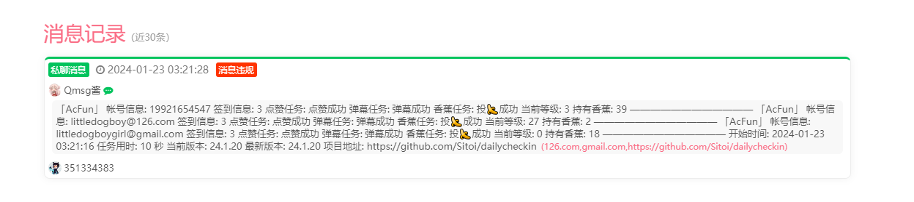

import { Cards, Card } from 'nextra/components'
import { Callout } from 'nextra/components'

<Cards>
  <Card
    title="BARK"
    href="/settings/notify/bark"
  />
  <Card
    title="CoolPush"
    href="/settings/notify/coolpush"
  />
  <Card
    title="钉钉"
    href="/settings/notify/dingtalk"
  />
  <Card
    title="飞书"
    href="/settings/notify/feishu"
  />
  <Card
    title="PushPlus"
    href="/settings/notify/pushplus"
  />
  <Card
    title="Qmsg 酱"
    href="/settings/notify/qmsg"
  />
  <Card
    title="企业微信应用消息"
    href="/settings/notify/qywx"
  />
  <Card
    title="企业微信群机器人"
    href="/settings/notify/qywxrobot"
  />
  <Card
    title="Server 酱"
    href="/settings/notify/server"
  />
  <Card
    title="Telegram"
    href="/settings/notify/telegram"
  />
  <Card
    title="Server 酱 TURBO"
    href="/settings/notify/turbo"
  />
  <Card
    title="Ntfy"
    href="/settings/notify/ntfy"
  />
  <Card
    title="Gotify"
    href="/settings/notify/gotify"
  />
</Cards>

# Qmsg 酱

<Callout type="warning">
  通知消息在 Qmsg 中被视为违规。 
</Callout>

### 配置示例

```json filename="config.json" copy
{
  "QMSG_KEY": "",
  "QMSG_TYPE": "",
  "MERGE_PUSH": ""
}
```

|       参数       |                                              说明                                              |
| :--------------: | :--------------------------------------------------------------------------------------------: |
|  _**QMSG_KEY**_  |              Qmsg 酱推送[官方文档](https://qmsg.zendee.cn/) ,填写 `KEY` 代码即可               |
| _**QMSG_TYPE**_  | Qmsg 酱推送[官方文档](https://qmsg.zendee.cn/) ,如果需要推送到群填写 `group`,其他的都推送到 QQ |
| _**MERGE_PUSH**_ |                         **true**: 将推送消息合并；**false**: 分开推送                          |
