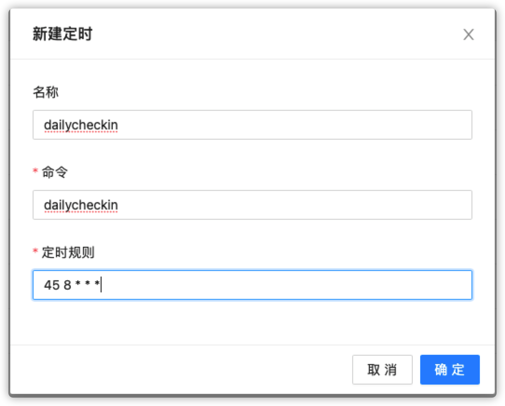

# 青龙使用教程

## 一、进入青龙容器内部

```bash
docker exec -it qinglong bash
```

## 二、安装依赖

```bash
apk add --no-cache gcc g++ python python-dev py-pip mysql-dev linux-headers libffi-dev openssl-dev
```

```bash
pip3 install dailycheckin --upgrade
```

## 三、编写 `/ql/config/config.json` 配置文件

参考[配置说明文档](https://sitoi.gitee.io/dailycheckin/settings/) ，并修改 `config.json`

## 四、配置定时任务



