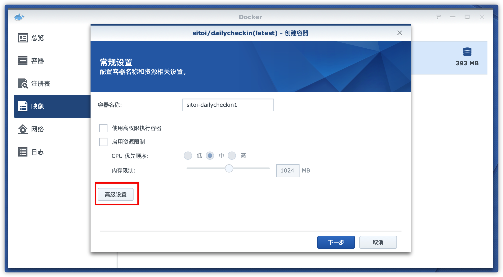
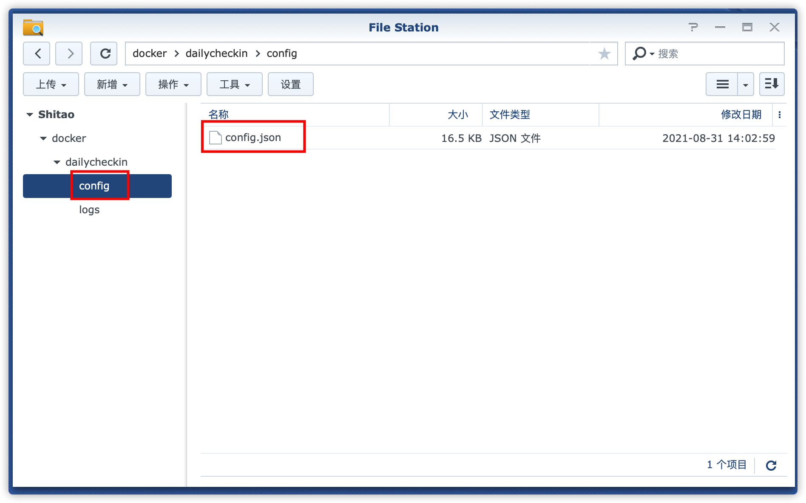

# 群晖 Docker 使用教程

## 一、下载安装并配置容器

1. 注册表搜索「dailycheckin」，双击下载
   
2. 下载完成后，点击映像，选中「dailycheckin」，点击「启动」
   
3. 点击「高级设置」
   
4. 「存储空间」,「添加文件夹」，「新建文件夹」，按照图中的文件夹添加一致的目录结构
   
5. 配置映射关系（如下图），点击「应用」
   
6. 点击「下一步」
   
7. 点击「应用」
   
8. 容器启动成功
   

## 二、上传配置文件「config.json」到 「dailycheckin/config」目录下

参考[配置说明文档](https://sitoi.gitee.io/dailycheckin/settings/) ，并修改 `config.json`

## 三、配置测试

1. 点击「详情」，「终端机」，点击「新增」右侧「下拉按钮」，输入「dailycheckin」命令
   
2. 点击命令，输出如下内容，表示配置成功
   
