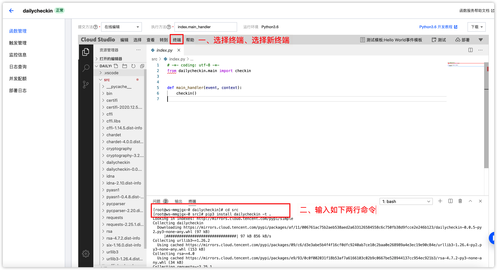

# 腾讯云函数教程

### 一、创建云函数

> 地域选哪里都可以


```python
# -*- coding: utf-8 -*-
from dailycheckin.main import checkin


def main_handler(event, context):
    checkin()
```

### 二、安装依赖包（更新依赖与安装一致）



```bash
cd src
pip3 install dailycheckin --upgrade -t .
```

### 三、添加配置文件

> ⚠️ 请务必到 [http://www.json.cn](http://www.json.cn) 网站检查 `config.json` 文件格式是否正确！


### 四、部署测试


