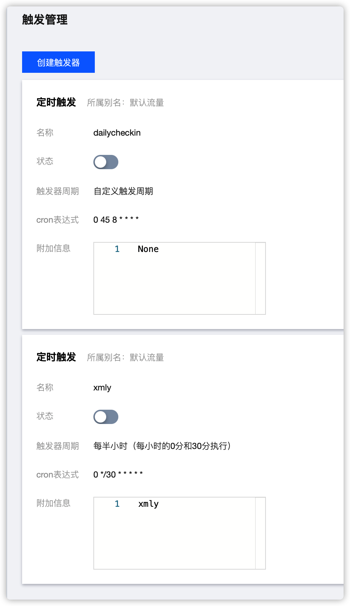

# 腾讯云函数教程

## 方式一、下载到本地修改后上传

> （腾讯云函数相关教程请自行百度）

### 一、下载（Clone）本项目到本地

> ⚠️ 下载的需要解压压缩包

- 下载地址: [https://pypi.org/project/dailycheckin](https://pypi.org/project/dailycheckin)

### 二、创建并修改 config.json 配置文件

拷贝 `config/config.template.json` 到 `config/config.json` 并修改

参考[配置说明文档](https://sitoi.github.io/dailycheckin/settings/) ，并修改 `config/config.json`

### 三、上传至【腾讯云函数】

云函数 → 函数服务 → 新建 → 自定义创建 → 本地上传文件夹 → 选择带有自定义配置文件的文件夹上传

### 四、配置定时触发器

进入函数 → 触发管理 → 新建触发器 → 安装下图进行配置

